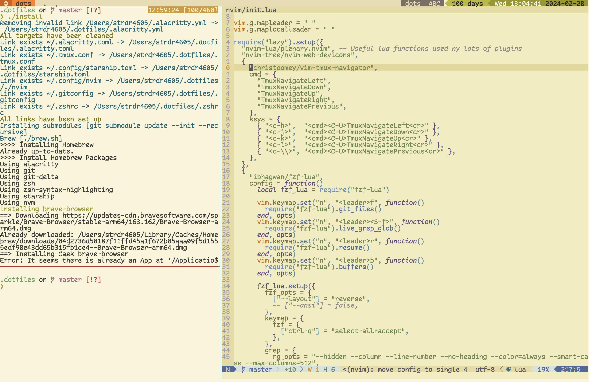

# .dotfiles

My current dev environment

- [brew](https://brew.sh)
  - [Brewfile](Brewfile) to install my apps 
- [neovim](https://neovim.io) (text editor from terminal)
- alacritty (terminal emulator)
  - previously [iterm](https://www.iterm2.com)
- zsh
- [tmux](https://github.com/tmux/tmux) (terminal multiplexer to handle my tabs/panes)
- Fira code nerd font

